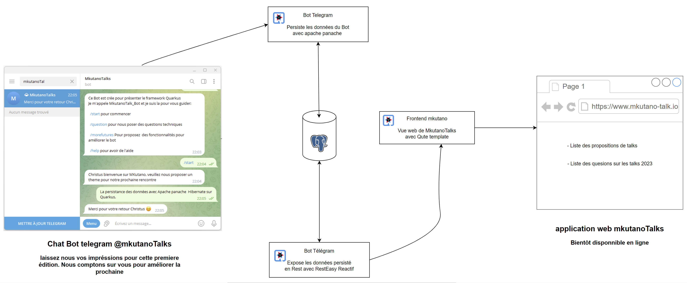

# MkutanoTalks

Application web realisé pour la démo du talk ***"Introduction à Quarkus Framework"*** à la prémiere édition du ***Mkutano***. 

***Mkutano*** est un évenement annuel qui réunit les africains passionnés de la tech pour partager et encourager la formation et l'innovation dans ce monde qui evolu à la vitesse lumiere. 

### Architecture de l'application - microservices

